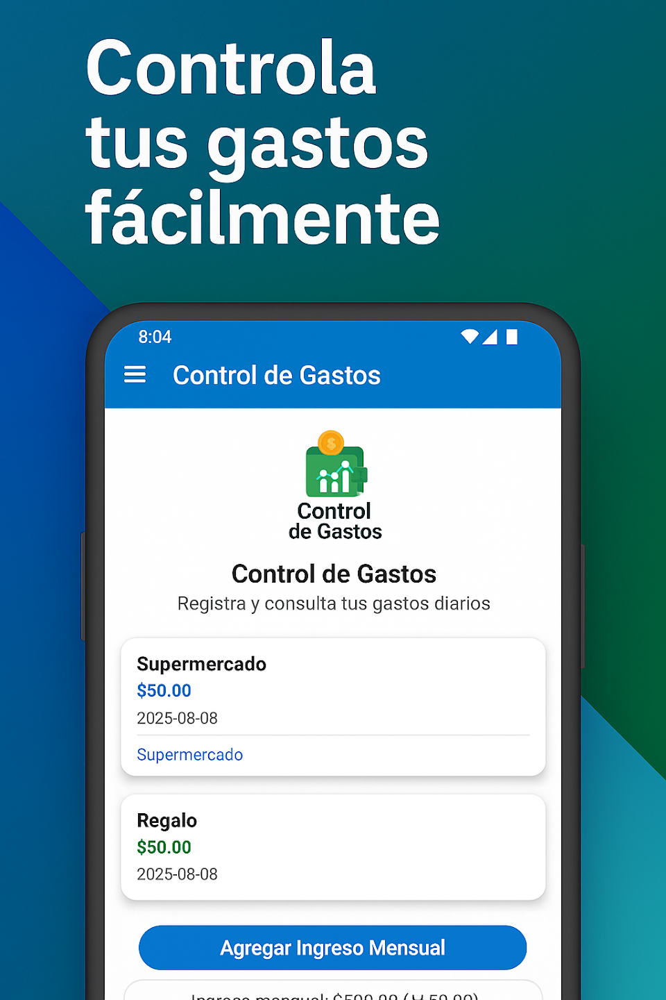
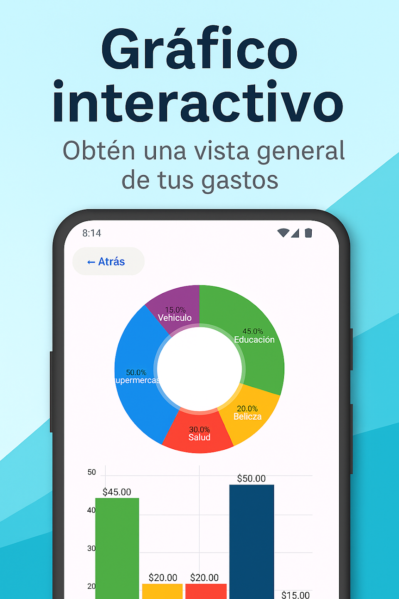
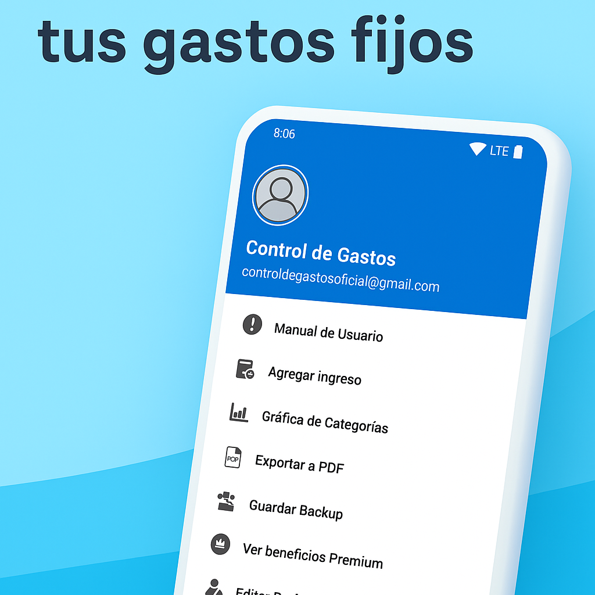
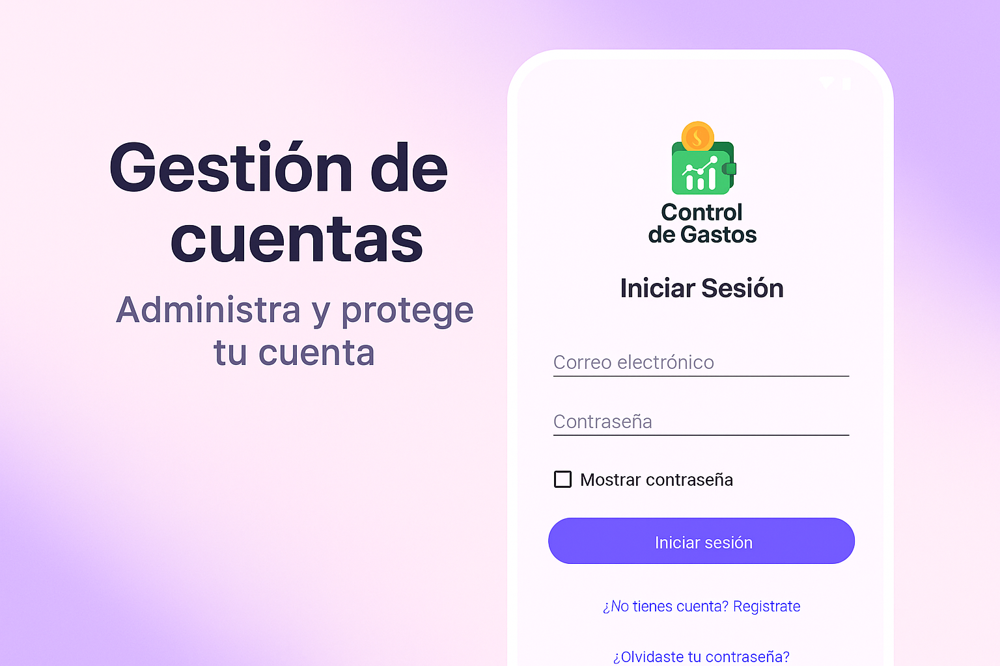
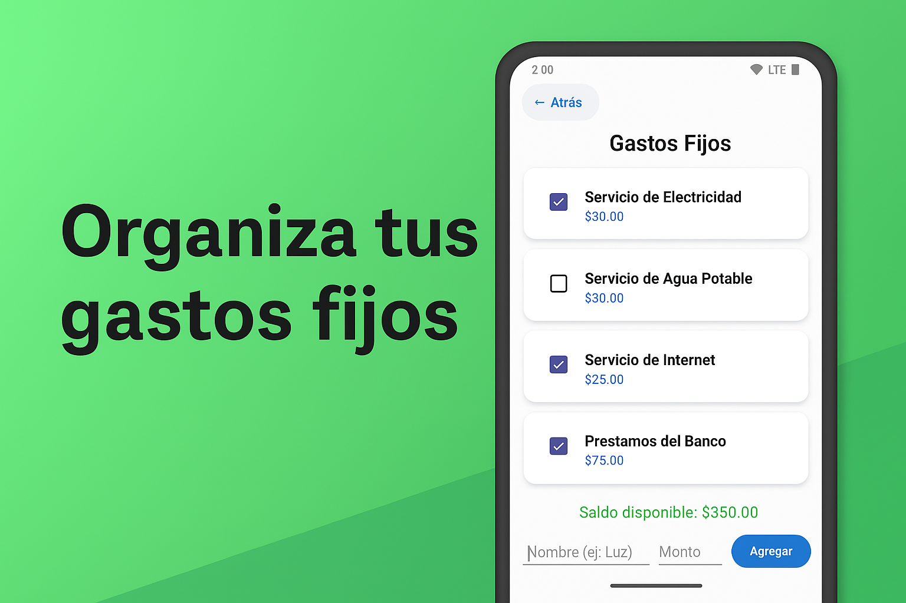

# 📱 Control de Gastos — App Android

Aplicación móvil para el control de gastos personales, desarrollada en **Java** con **Android Studio**, utilizando **Room Database**, **Firebase Authentication**, **AdMob**, y un sistema **Premium** con beneficios exclusivos.  
Diseñada para ofrecer una experiencia moderna, simple y eficiente para usuarios que desean mantener sus finanzas organizadas.

---

## 🌟 Características principales

### ✔ Gestión de gastos diarios
- Agrega, edita y elimina gastos.
- Lista limpia y organizada por categorías.
- Registro completo con fecha y descripción.
- Ingreso mensual configurable.

### ✔ Gastos fijos
- Lista especial para gastos recurrentes.
- Administración separada del resto de gastos.
- Cálculo automático de saldo disponible.

### ✔ Modo Premium
Funciones exclusivas para usuarios Premium:
- 📊 **Gráficas interactivas** (pastel, barras y línea).
- 📄 **Exportación a PDF profesional**.
- ☁️ **Respaldo (backup) en la nube usando Firebase**.
- 🔐 **Sin anuncios**.
- 📂 **Exportación a Excel (próximamente)**.
- 🔔 **Recordatorios de gastos fijos**.

### ✔ Seguridad y autenticación
- Inicio de sesión con Firebase Authentication.
- Recuperación de contraseña.
- Gestión de perfil (nombre + foto).

---

## 🛠 Tecnologías utilizadas

- **Java (Android)**
- **Android Studio**
- **Room Database**
- **Firebase Authentication**
- **Firebase Realtime Database**
- **Google AdMob**
- **Google Play Billing (Premium)**
- **MPAndroidChart**
- **Material Design 3**

---

## 📸 Capturas de pantalla

### 🏠 Pantalla Principal


### 📊 Gráficos Premium


### 📂 Menú lateral


### 🔐 Login


### 💰 Gastos fijos


---

## 📦 Instalación y compilación

1. Clona este repositorio:

```bash
git clone https://github.com/Fradeh/ControlDeGastos.git
```

2. Ábrelo en Android Studio.

3. Espera a que Gradle configure el proyecto.

4. Conecta un dispositivo o usa un emulador.

5. Ejecuta la app con Run ▶.

---

## 📁 Estructura del proyecto

```
com.freddy.controldegastos
 ├── AUTH/               # Login, registro, splash
 ├── BD/                 # Room Database (DAOs, AppDatabase)
 ├── GASTOS/             # Gastos normales
 ├── GastosFijos/        # Gastos fijos
 ├── PREMIUM/            # Funciones Premium
 └── UTILS/              # Helpers, servicios, receptores y herramientas
```

---

## 🧑‍💻 Autor

**Freddy Herrera**  
Desarrollador Android — Panamá 🇵🇦  
📧 herrerafrdd@gmail.com  
🐙 GitHub: https://github.com/Fradeh

---

## ⭐ Contribuciones  
¡Las contribuciones, sugerencias y mejoras son bienvenidas!

---

## 📄 Licencia  
Este proyecto es de uso personal y académico.  
Puedes revisarlo y aprender de él, pero no está permitido publicarlo como propio ni utilizarlo comercialmente.
